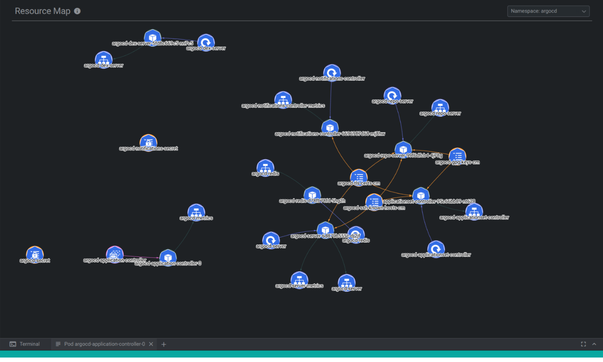

# Freelens Resource Map Extension

> [!WARNING]
> This extension is currently in development and is considered unstable. The API is subject to change, and you may encounter bugs or incomplete features.
> Use it at your own risk, and contribute by reporting issues or suggesting improvements!

A Freelens extension to visualize Kubernetes resources and their relations as an interactive graph.

## Features

- Interactive graph visualization of Kubernetes resources
- Resource relationship mapping (pods, services, deployments, etc.)
- Namespace filtering (in progress)
- Visual indicators for resource status and health
- Click navigation to resource details

## Credits

This extension is a modernized fork of the [Kube Resource Map](https://github.com/nevalla/lens-resource-map-extension) extension originally created by [Lauri Nevala](https://github.com/nevalla).

## License

MIT License - see the [LICENSE](./LICENSE) file for details.
